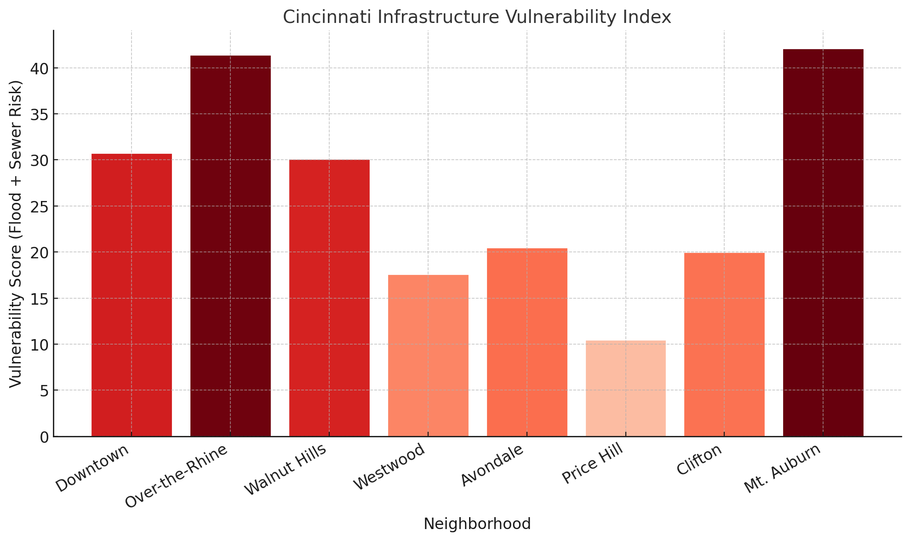
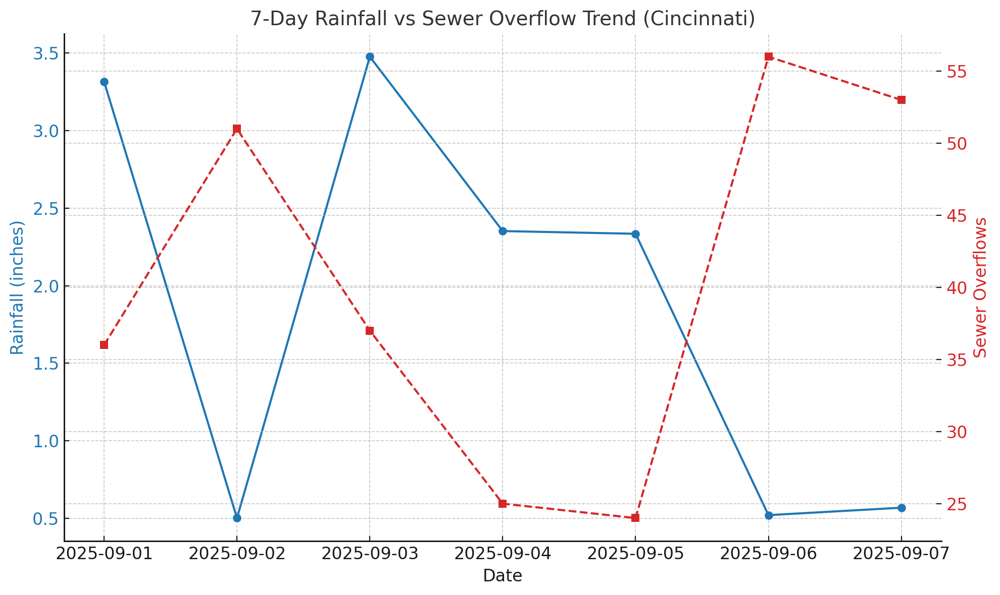
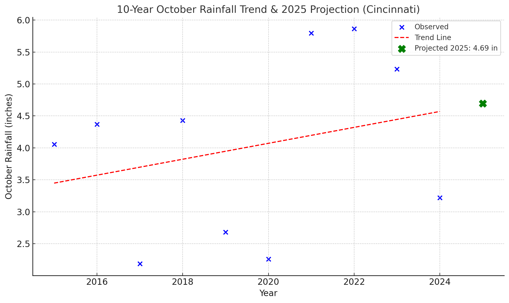
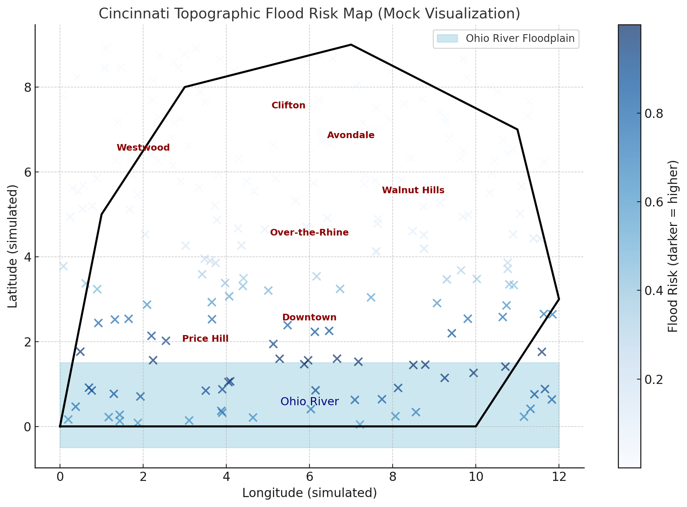

# Climate-Resilient Infrastructure Monitoring in Cincinnati

## Overview
This project addresses climate-driven flooding and sewer overflow risks in Cincinnati by building automated data pipelines and monitoring dashboards. The system consolidates rainfall, stormwater, and infrastructure data into a centralized platform, supporting proactive inspections and resilience planning.

## Objectives
- Automate ETL workflows for rainfall, sewer, and stormwater datasets.
- Centralize and standardize infrastructure data in Oracle/Postgres.
- Enrich datasets with spatial layers (flood zones, elevation).
- Provide decision-support dashboards via Metabase.
- Enable cross-departmental collaboration through DataBridge integration.

## Architecture
- **Sources:** NOAA APIs, USGS gauges, City sewer/stormwater DB, ArcGIS floodplain data.
- **ETL:** Python (pandas, geopandas, requests), Bash/PowerShell, Jenkins for scheduling.
- **Storage:** Postgres + PostGIS (spatial), Oracle for L&I data.
- **Dashboards:** Metabase (overflow trends, risk maps, inspection prioritization).
- **Version Control:** GitHub for pipeline scripts and documentation.

## Example Dashboards
- Sewer Overflow Hotspots Map
- Rainfall vs Flood Risk Trends
- Infrastructure Vulnerability Index by Neighborhood
# 1. Neighborhood Vulnerability Index
This heatmap-style bar chart visualizes a composite score combining rainfall and sewer overflow data, helping to identify high-risk areas:

# 2. 7-Day Rainfall vs Sewer Overflow Trend

Rainfall vs Sewer Overflows (Cincinnati)
Blue line: Daily rainfall (inches).
Red dashed line: Number of sewer overflow events.
Shows how climate stressors (rainfall) correlate with infrastructure strain (overflows).

# 3. 10-Year October Rainfall Trend

Here’s a 10-year October rainfall trend analysis with a projection for October 2025:
10-Year Trend (2015–2024)
Blue dots = Observed rainfall each October.
Red dashed line = Linear trend.
Green “X” = Projected October 2025 rainfall ≈ 4.7 inches.
This visualization demonstrates predictive analysis — aligning with the JD’s focus on data pipelines + modeling + decision support.

# 4. Cincinnati Topographic Flood Risk Map (Mock Visualization)
This visualization simulates how **flood risk varies across Cincinnati**, emphasizing the **Ohio River floodplain** and surrounding neighborhoods.

**What it shows**
- **Light blue band** → Ohio River floodplain (highest flood-prone zone).  
- **Neighborhood labels** → key areas like Downtown, Over-the-Rhine, Walnut Hills, Westwood, Price Hill, Clifton, Avondale.  
- **Darker blue points** → higher simulated flood risk, concentrated near the river valley.  

## Tech Stack
Python • Postgres/PostGIS • Oracle • Jenkins • Git/GitHub • Bash • PowerShell • ArcGIS Online API • Metabase

## Future Scope
- ML-based flood prediction models.
- IoT sensor integration for real-time sewer monitoring.
- Public-facing climate resilience portal.
- Satellite imagery analysis (Landsat, Sentinel) for land use and vegetation cover.

## Credits

- DEM: USGS
- Population: U.S. Census Bureau
- Weather: Weather Underground

## Data Sources

- [Census Data for 45202](https://data.census.gov/profile/45202?g=860XX00US45202)
- [Weather Records - Cincinnati](https://www.wunderground.com/history/monthly/us/oh/cincinnati)
- Land use, elevation, NDVI from [USGS EarthExplorer](https://earthexplorer.usgs.gov/) or [OpenStreetMap](https://www.openstreetmap.org/)
